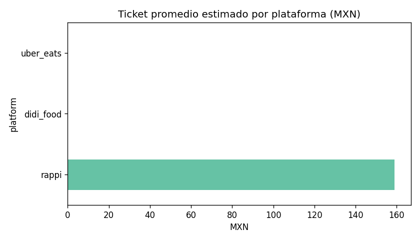
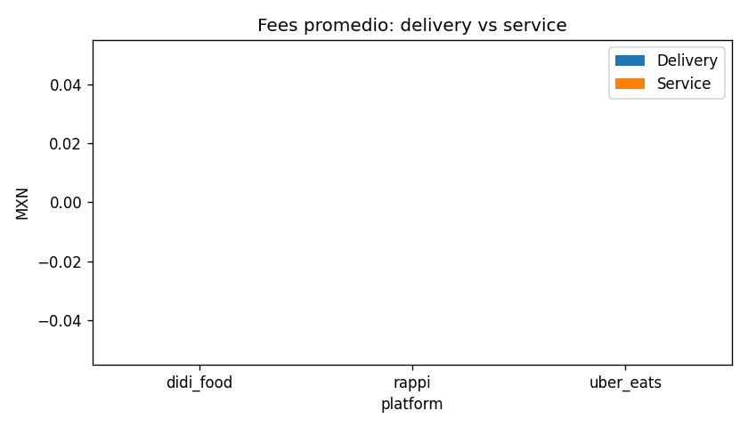
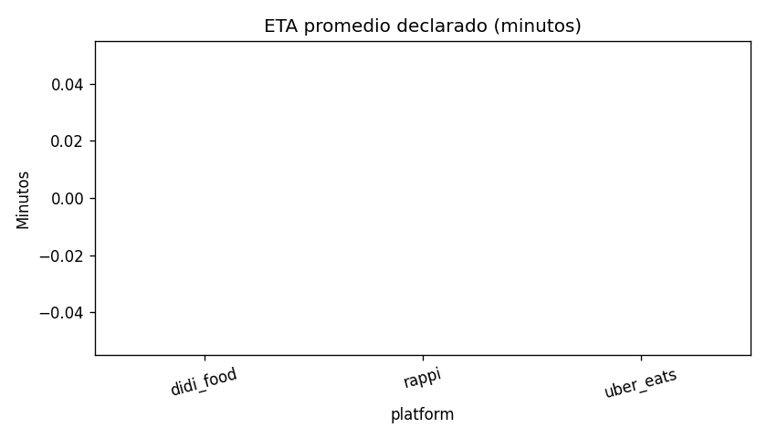

# Informe — Competitive Intelligence (México)

_Fuente CSV: `scrape_latest.csv`. Filas: 45._

## Calidad y procedencia de datos

**Origen (`data_source`):** `playwright_rappi` (15 filas); `playwright_uber_eats` (15 filas); `playwright_didi_food` (15 filas)

- Hay filas de **scrape web (Playwright)**. Los números dependen de la UI del momento; validar fees/precios que parezcan atípicos.

**Cobertura (% filas con precio de ítem):** `didi_food` 0%, `rappi` 80%, `uber_eats` 0%

## Comparativo rápido

- **Solo una plataforma con ticket calculable:** `rappi` (~159.0 MXN).
- **Delivery fee más bajo en promedio:** `rappi`.
- **ETA:** sin datos numéricos suficientes.
- **Ciudad con mayor dispersión entre plataformas (ticket):** `Ciudad de México`.
- **Tasa filas con promoción visible (no 'Ninguna'):** `didi_food` 100%, `rappi` 100%, `uber_eats` 100%

## Visualizaciones

## Top 5 insights accionables

1. **Finding:** La comparación de ticket entre plataformas está **incompleta** (faltan precios o totales en una o más apps).  
   **Impacto:** Riesgo de conclusiones sesgadas si solo una plataforma tiene cobertura.  
   **Recomendación:** Priorizar scrape estable por plataforma o datos licenciados antes de presentar benchmarks.

2. **Finding:** `rappi` concentra delivery fees medios más bajos.  
   **Impacto:** Competencia en costo de envío en zonas periféricas.  
   **Recomendación:** Simular subsidio parcial de envío en `zone_type=periphery` priorizado.

3. **Finding:** No hay ETA numérico suficiente para comparar plataformas en este CSV.  
   **Impacto:** Expectativa de tiempo en UX y retención.  
   **Recomendación:** Validar ETA con varias ventanas horarias y ubicación exacta (mismo punto en las tres apps).

4. **Finding:** Mezcla de promos visibles difiere por plataforma en el CSV.  
   **Impacto:** Guerra promocional en adquisición.  
   **Recomendación:** Tablero semanal de tipo de promo por zona y vertical (extender scrape).

5. **Finding:** Alta variabilidad inter-plataforma en `Ciudad de México`.  
   **Impacto:** Pricing inconsistente percibido por usuario.  
   **Recomendación:** Deep-dive de fees + restaurante ancla (misma cadena cross-app) en esa ciudad.

---
_Completar scrape o revisar filas sin `eta_minutes`._
